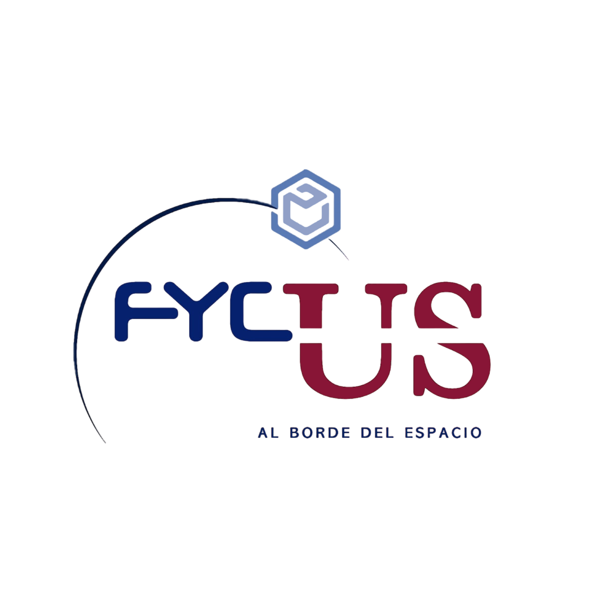
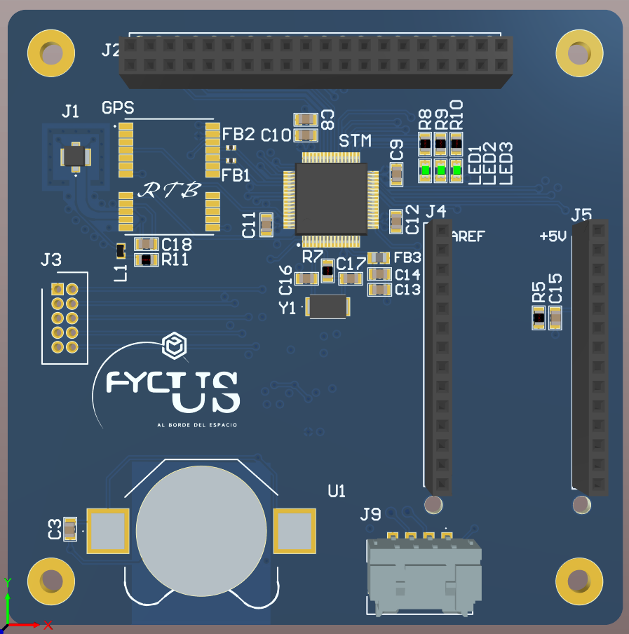
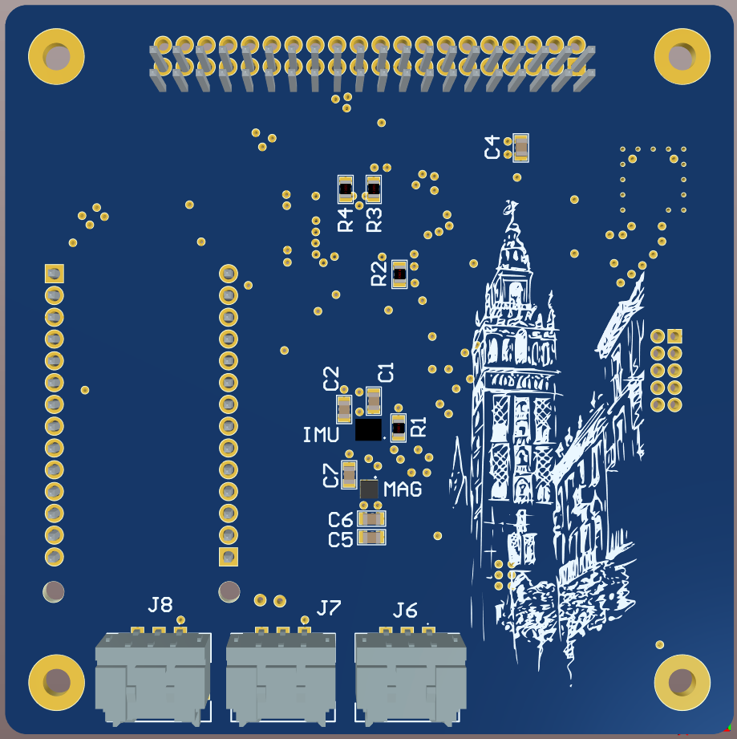

# OBC FyCUS 2023
OBC + AOCS + Modem software and PCB design

##  &nbsp; PCB design

## ✒️ &nbsp; Author 
* **Rubén Torres Bermúdez** - [RubenT17](https://github.com/RubenT17)

## 📄 &nbsp; License

This project is licensed under the General Public License - see the LICENSE.md file for details

## ❓ &nbsp; Where to ask questions 

| Type                            | Platforms                               |
| ------------------------------- | --------------------------------------- |
| 🚨 **Bug Reports**              | [GitHub Issue Tracker](https://github.com/RubenT17/FyCUS2023/issues)                 |
| 🎁 **Feature Requests & Ideas** | [GitHub Issue Tracker](https://github.com/RubenT17/FyCUS2023/issues)                 |

